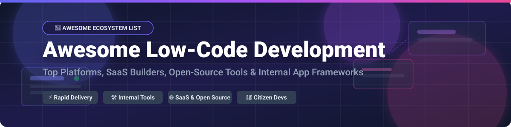

  

# 🚀 Awesome Low-Code Application Development 

  
  
  
  
  

> ⚡ **Curated List of Low-Code Application Development Platforms, SaaS Products & Open-Source GitHub Projects**
> 
> *Focused on Visual App Builders, Internal Tools, Citizen Development, Drag-and-Drop Interfaces, Admin Panels & Rapid Application Delivery.*

---

## 💡 Overview & SEO Guide 🔍

This repository tracks notable **SaaS platforms** and **open-source projects** for **Low-Code Application Development (LCAD)** and **No-Code Web App Building**. These platforms enable rapid creation of enterprise web applications, mobile apps, admin dashboards, and internal workflow tools through visual drag-and-drop builders, pre-built widget libraries, database integrations, and minimal hand-coding—serving both professional software engineers and business citizen developers.

Whether you are looking for enterprise-grade low-code solutions like **Microsoft Power Apps** and **OutSystems**, flexible internal tool builders like **Retool** and **Appsmith**, or open-source database alternatives like **Supabase** and **Directus**, this curated awesome list serves as your definitive ecosystem reference guide.

---

## 📑 Table of Contents 📌

- [💼 SaaS / Hosted Platforms](#-saas--hosted-platforms)
- [🔓 Open-Source GitHub Projects](#-open-source-github-projects)
- [🤝 How to Contribute](#-how-to-contribute)
- [☕ Support & Sponsorship](#-support--sponsorship)
- [⭐ Star History](#-star-history)
- [⚠️ Disclaimer](#-disclaimer)

---

## 💼 SaaS / Hosted Platforms 🌐

> 📊 **Market Insights & Industry Dynamics:**  
> The global Low-Code Application Development platform market size is estimated at **\$33 Billion–\$50 Billion in 2026** and projected to reach over **\$100+ Billion by 2030**. The market is **moderately fragmented**, featuring tech giants dominate enterprise IT suites alongside highly valuation-rich specialized SaaS vendors targeting internal developer toolchains and rapid MVP development.

Below is a breakdown of top SaaS low-code platforms, sorted by **Company Size / Valuation / Revenue (Descending)**:

| Platform 🛠️ | Description 📝 | Starting Price 💵 | Free Tier / Trial Limits 🎁 | Enterprise Size & Valuation 🏢 |
| :--- | :--- | :--- | :--- | :--- |
| **[Microsoft Power Apps](https://powerapps.microsoft.com/)** | Low-code platform tightly integrated with Microsoft 365, Dataverse, & Azure. | **\$20 / user / month** | Free Developer Plan (non-production, 2GB Dataverse) or 30-day free trial. | **\$3.3+ Trillion Market Cap** (Microsoft parent) |
| **[Zoho Creator](https://www.zoho.com/creator/)** | Low-code app development platform for custom business workflow automation. | **\$8 / user / month** | Free Forever Plan (1 user, 1 app, 250MB storage, 250 API calls/day). | **\$12.5 Billion Valuation** (\$1.5B Revenue) |
| **[OutSystems](https://www.outsystems.com/)** | Enterprise low-code platform focused on full-stack web/mobile scalability. | **\$36,300 / year** (base capacity) | Free Personal Edition (1 environment, non-production, up to 100 testing users). | **\$9.5 Billion Valuation** (\$500M+ Revenue) |
| **[Retool](https://retool.com/)** | Developer-centric low-code platform specialized in building internal admin panels. | **\$10 / builder / month** | Free Forever Plan (Up to 5 standard users, 500 workflow runs/mo, 5GB data). | **\$3.2 Billion Valuation** (\$120M+ Revenue) |
| **[Appian](https://appian.com/)** | Enterprise low-code automation platform strong in process orchestration & AI. | Custom enterprise quotes | Appian Community Edition (Free dedicated instance for learning & building). | **\$2.63 Billion Market Cap** (\$545M+ Revenue) |
| **[Mendix](https://www.mendix.com/)** | Siemens-owned platform for rapid enterprise multi-cloud development. | **€900 / month** (single app) | Free Edition (€0/mo, unlimited apps, auto-shutdown after 1 hr inactivity). | **\$730 Million Acquisition** (\$250M+ Revenue) |
| **[Quickbase](https://www.quickbase.com/)** | No-code/low-code operations platform for custom workflow and data applications. | **\$35 / user / month** | 30-Day Free Trial (Full Business tier features, limited to 10 test users). | **\$1.0+ Billion Valuation** (\$215M+ ARR) |
| **[Bubble](https://bubble.io/)** | No-code platform for building full-featured web applications and MVPs. | **\$32 / month** (billed annually) | Free Forever Plan (Bubble branding, test domain, limited workload units & backend). | **~\$500M Valuation Est.** (\$80M–\$90M Revenue) |
| **[Betty Blocks](https://www.bettyblocks.com/)** | Enterprise no-code app builder designed for citizen developers and governance. | **~\$1,400 / month** | No free tier or trial (direct enterprise demo & multi-year licensing). | **~\$50M Valuation Est.** (\$9.1M Revenue, \$33M Funding) |
| **[Glide](https://www.glideapps.com/)** | No-code platform that turns spreadsheets and databases into polished web/mobile apps. | **\$19 / month** | Free Plan (\$0/mo, unpublished sandbox mode for building & testing apps). | **~\$40M Valuation Est.** (\$3.7M ARR, \$24M Funding) |

---

## 🔓 Open-Source GitHub Projects 🌟

Open-source low-code tools offer complete self-hosting freedom, full control over enterprise security compliance, and zero vendor lock-in.

Below are the top open-source low-code frameworks, sorted by **GitHub_Stars (Descending)**:

-  **[Supabase](https://github.com/supabase/supabase)** ⚡  
  The open-source Firebase alternative providing auto-generated APIs, real-time Postgres database, authentication, and storage.

-  **[n8n](https://github.com/n8n-io/n8n)** 🔄  
  Fair-code workflow automation platform combining visual node-based building with custom JavaScript/Python flexibility.

-  **[Appsmith](https://github.com/appsmithorg/appsmith)** 🛠️  
  Leading open-source low-code platform (Apache-2.0) for building internal tools, admin panels, and CRUD dashboards.

-  **[ToolJet](https://github.com/ToolJet/ToolJet)** 🚀  
  Extensible open-source low-code framework for internal tools with JS/Python support and AI query building.

-  **[Directus](https://github.com/directus/directus)** 🗄️  
  Open-source data platform that turns any SQL database into an instant REST/GraphQL API and intuitive admin app.

-  **[PocketBase](https://github.com/pocketbase/pocketbase)** 📦  
  Open-source single-file Go backend with embedded SQLite DB, real-time subscriptions, auth, and admin dashboard.

-  **[Budibase](https://github.com/Budibase/budibase)** 📊  
  Open-source low-code platform for building internal apps, forms, and business workflows on existing databases.

-  **[Refine](https://github.com/refinedev/refine)** ⚛️  
  React-based open-source meta-framework for rapid enterprise internal tools, admin panels, and B2B dashboards.

-  **[Baserow](https://github.com/bram2w/baserow)** 📋  
  Open-source no-code database and application builder positioned as a self-hosted Airtable alternative.

-  **[ILLA Builder](https://github.com/illacloud/illa-builder)** 🎨  
  Low-code tool for developers to quickly build internal tools, CRUD apps, and integrations with modern UI widgets.

-  **[NocoBase](https://github.com/nocobase/nocobase)** 🔌  
  Extensible open-source no-code/low-code platform built with a plugin architecture and data-model-first approach.

-  **[Lowdefy](https://github.com/lowdefy/lowdefy)** 📄  
  An open-source YAML-first low-code framework to build web apps, admin panels, and reporting dashboards.

---

## 🤝 How to Contribute 📝

Contributions are welcome! Please follow these simple steps to contribute:

1. 🍴 **Fork** this repository.
2. ➕ **Add or edit** entries in `README.md` keeping formatting consistent.
3. ℹ️ Include the project name, link, concise 1-2 sentence description, pricing/Stars_Badges, and category.
4. 📬 Submit a **Pull Request** with a brief summary of changes.

---

## ☕ Support & Sponsorship 🙏

If you find this repository helpful for evaluating low-code platforms or choosing your next tech stack, please consider supporting the project!

- ⭐ **Star** this repository to show your appreciation.
- 🔀 **Fork** and share with your fellow developers and platform teams.
- 💖 **Sponsor / Buy a Coffee:** You can support ongoing maintenance via the [GitHub Sponsor Dashboard](https://github.com/sponsors/ishandutta2007).

---

## 📈 Star History ⭐

---

## ⚠️ Disclaimer 📜

- This repository is a **community-curated list** provided for educational and informational purposes only.
- Low-code and no-code tools handle application logic and enterprise data. Ensure proper security auditing, data governance, and access controls before deploying production applications.
